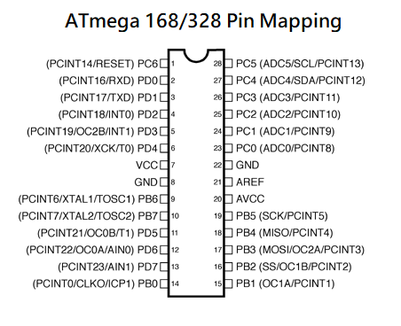

# CS12-AVR
An embedded AVR assembly project. This is my proposed final project for CS12, Assembly Language & Computer Architecture (86x64).
 
## Resources & References 
 
[Atmel includes](https://github.com/DarkSector/AVR/tree/master/asm/include)
 
[AVR Instruction Set Atmel 2016](http://ww1.microchip.com/downloads/en/devicedoc/atmel-0856-avr-instruction-set-manual.pdf)
[AVR Instruction Set Microchip 2020](http://ww1.microchip.com/downloads/en/DeviceDoc/AVR-Instruction-Set-Manual-DS40002198A.pdf)
 
[Beginners Introduction to the Assembly Language of ATMEL-AVR-Microcontrollers](http://www.avr-asm-download.de/beginner_en.pdf)

[ATmega48A/PA/88A/PA/168A/PA/328/P Data Sheet](http://ww1.microchip.com/downloads/en/DeviceDoc/ATmega48A-PA-88A-PA-168A-PA-328-P-DS-DS40002061B.pdf)
 
[Atmel Studio](https://ww1.microchip.com/downloads/en/DeviceDoc/Getting-Started-with-Atmel-Studio7.pdf)

[Tutorials](http://www.rjhcoding.com/avr-asm-tutorials.php)

## Flashing

A limited number of ISP programmers are supported by Atmel Studio 7

The hex file can also be flashed to the MCU using other cheap avrdude-supported ISP programmer. [AVRDUDE](https://www.nongnu.org/avrdude/) is a utility to download/upload/manipulate the ROM and EEPROM contents of AVR microcontrollers using the in-system programming technique (ISP). 

The command for flashing Hello_AtmelStudio using a USBasp programmer is the following:

 `avrdude -p m328 -c usbasp -e -U flash:w:Hello_AtmelStudio.hex`
 
